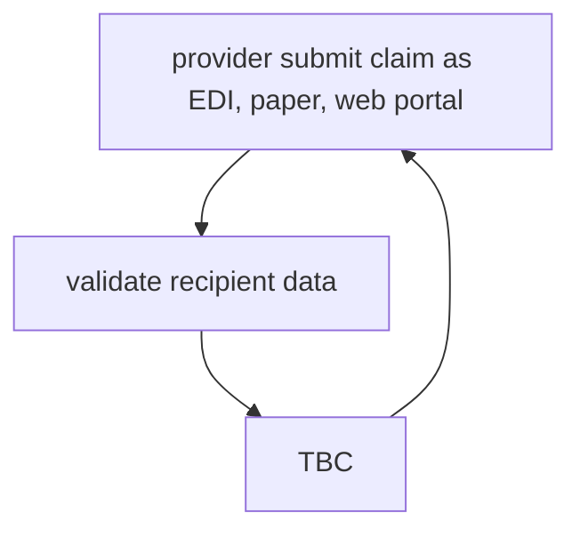

# Note from internal course: Medical Coding (CHU)
## Insurance Billing Process
- 

  
## provider billing cycle:
- 1. Insurance Verification
- 2. Patient Demographic entry
- 3. CPT & ICD-10 coding
- 4. Charge entry
- 5. Claim submission
- 6. Payment posting
- 7. accounts receivable (A/R) follow-up: recovering over-due payments from insurance carriers
- 8. Denial managment
- 9. Reporting

## CPS (claims processing systems)
- Eligibility: Coverage on date of service, type of coverage/benefit plan
- Provider verification: billing, service, National Provider Identification (NPI) number
  -  Each claims need provider validation 
    -  a provider may have multiple contracts
    -  contracts drive reimbursement
    
### Duplicate claims
- Member, provider, date of service (DOS), Procedures, Total Billed
### Validate pre-certification/ pre-authorization
- Procedure, Place of Service, Diagnosis
### Determine medical necessity / medical appropriateness
- Within guidelines of quality care
### Correct coding
- Age, gender, incidental, mutually exclusive

### payment of a service on a claim
- fee schedule (pre-priced: e.g. Bluecross depends on the home state)
- resonable and customary or usual and customary
- DRG (Diagnostic related grouping)
- APC (ambulatory payment categories)
- Episode of care
 
 ### CPS adjudication process
 - Edit codes designate the final status of a claim: payable (paper check, ERA, or electronic fund transfer), denied (no money send to provider), pend

### Claim editing
- ensure that claims abide by current policy criteria by the payer
- claims are processed against various edit and audit checks before the final adjudication and disposition of the claim
- edits verify the accuracy, validity, required presence, format, consistency, allowable values, and data integrity
#### Claim may be deemed payable / denied based upon:
- industry standard editing
  - American Medical Association (AMA)
  - CPT codes, guideline, and conventions
  - National Corret Coding Initiative (NCCI)
  - CMS payment rules
- Policy editing: proprietary claim audits
  - contract guidelines
  - Member exclusions
  - Plan guidelines
#### CMS.gov (Centers for Medicare & Medicaid Services)
- Largest payer organization
  - prepayment claim review programs (NCCI, Medically Unlikely Edits <MUEs>)
  - postpayment claim review programs (Comprehensive Error Rate Testing <CERT>, Recovery Audit Program)
 
### Type of codes
  - Comprehensive: include certain services that are separately identified by other component codes
  - Component: considered members of a code family and included in a comprehensive code
  - Mutually Exclusive: procedures that cannot be reasonably performed in the same session

### Common health insurer claim edits
- edits based on CPT, CCI, and Medicare
  - procedure code is only allowed with one or more other procedure code(s)
  - procedure code is only allowed with other procedure code with 25 or 59 modifier
  - procedure and age conflict
  - procedure code is not allowed with other procedure code
  - procedure and gender conflict
  - procedure code is only allowed with other procedure with modifier
  - procedure is not allowed
  - global services package
  - automated lab panel adjustment
  - diagnosis and age conflict
  - new patient E&M not allowed
- edits based on health insurer proprietary edits
  - procedure is not allowed with other procedure
  - procedure is not allowed
  - Global services packages
  - modifer code and place of service conflict
  - procedure code is only allowed with one or more other procedure code(s)

## Common coding errors
  - Code incorrect for the age of a patient
  - Global surgery denials (Pre op and Post op)
  - An officie visit billed as well as surgery by provider on the same day
  - Second new patient visit billed within 3 years of the first new patient visit
  - Duplicate office visit by the same provider on the same date
  - Incidentals such as blood draw, performing vitals, routine urinalysis are billed, as well as an office visit
  
### Category I code
  - Evaluation & Management 99201 - 99499
  - Anethesiology 00100 - 01999 and 99100 - 99140
  - Radiology 70010 - 79999
  - Pathology & Laboratory 80047 - 89398
  - Medicine 90281 - 99199 and 99500 - 99607
    - subsections with anatomic, procedural, condition or descriptor subheadings
    - All code sections have unlisted procedure codes for non-standard CPT services 
    - codes are a combination of professional and technical components
      - global procedure (w/t modifiers)
      - professional component (26 modifier)
      - technical component (TC modifier)
  
```
  Codes for noninvasive or minimally invasive (primarly percutaneous access) services that would not be considered open surgical procedures, or Evaluation & Management services
```
  
### Anesthesia and Pain Management coding, complicated, examples:
  - Numbing an arm to suture it
  - General anethetic for a heart transplant
  - Injections to control pain from an ongoing condition
  - - Area of body where the surgery is being performed
  - - patient's condition during the anethesia (physical status modifiers P1 - P6, consistent with Amercian Society of Anesthesiologists, ASA, **used with anesthesia codes only**)
  - - modifying circumstances code: 99100, 99116, 99135, 99140
  - - Length of time is reported as a part of the billing
  - - Anesthesia code includes: pre and post op visits by the anesthesiologist, anesthesia care during the procedure, administration of fluid or blood and the usual monitoring services

```
Anesthesia: ASA modifiers (physical status modifier)
P1 – a normal, healthy patient
P2 – a patient with mild systemic disease
P3 – a patient with severe systemic disease
P4 – a patient with severe systemic disease that is a constant threat to life
P5 – a moribund patient who is not expected to survive without the operation
P6 – a declared brain-dead patient whose organs are being removed for donor purposes
  - - P1 and P2 are typical, P3 - P5 require additional documentation to justify higher amount of reimbursement from payers, P6 not covered
```
### Common anesthesia coding errors
  - invalid or non-use of modifiers
  - global surgery denial
  - pre op
  - post op
  - billing anesthesia code when surgery code includes anesthesia

### Common surgery coding errors:
  - incorrect code for the age of the patient
  - incorrect code for the gender of the patient
  - billing additional codes without the base code
  - performing site specific procedures without modifiers
  - billing services separately that are a part of a surgery package
  - Coding two procedures on the same site on the same day that normally would not be performed
  - Duplicate services by the same provider on the same date
  
 ### Common pathology and laboratory coding errors:
  - billing for individual lab tests that make up one of the panel tests
  - coding for the wrong type of procedure
  - billing separately for services included in the main service
  - duplicate services (same provider, same date)
  
 ### Common radiology coding errors:
  - incorrect code for the age of the patient
  - incorrect code for the gender of the patient
  - coding two unilateral codes instead of the bilateral code
    - (bilateral surgery indicators) unilateral: ONE SIDE; bilateral: BOTH SIDES
  - duplicate services (same provider, same date)
  - coding for the wrong type of procedure

### Modifers
 - Category I CPT modifiers are maintained by AMA (two numeric digits)
 - HCPCS modifiers are maintained by CMS (two alphanumeric: AA through ZB)
  
### Place of Service (POS) Codes
 - Two-digit codes on **professional claims**
 - indicate the settings in which a service was provided
 - Required by HIPPA to standardize and maintained by CMS
 - to determine the acceptability of direct billing of Medicare, Medicaid, and private insurance services
  
### ICD-10 CM/PCS 
  - (International Classificaiton of Disease, 10th Edition, Clinical Modification / Procedure Coding System)
    - CM: diagnosis coding
    - PCS: inpatient procedure coding
  - Based on the WHO 10th revision of the international classification of diseases, clinical modification
  - overseen by NCHS (National Center of Health Statitics) and CMS (Centers for Medicare and Medicaid Services)
  - approved by AHA, AHIMA, CMS, NCHS
  - updated annually in July
  - structure
    - 3 to 7 alphanumeric (alpha characters are NOT case sensitive)
    - digit 1 is alpha, digit 2 numeric
    - decimal after third character
    - A00.0 to Z99.8 for CM
      - NEC: Not elsewhere classifiable (no specific code available to represent the condition)
      - NOS: Not otherwise specified ("unspecified", not enough info)
  
  ### Paper claims submission CMS 1450 and 1500
  - CMS 1500 form is created and maintained by NUCC (national uniform claim committee)
    - Header level claim information (identify member info)
    - required fields and optional fields
  - CMS 1450 form (UB04)
    - standardization process of inpatient /hospital info from provider to payer
    - Diagnosis: ICD-10-CM, DRG
    - Procedure: CPPT, HCPCS, ICD-10-PCS, APC (Ambulatory Patient Classifications, only applicalbe to hospitals)
    - Revenue codes: where and when services are performed in hospital billing, not used by physician.
    - Occurrence codes and condition codes: provide additional info that may affect payer's judication and billing.
  
